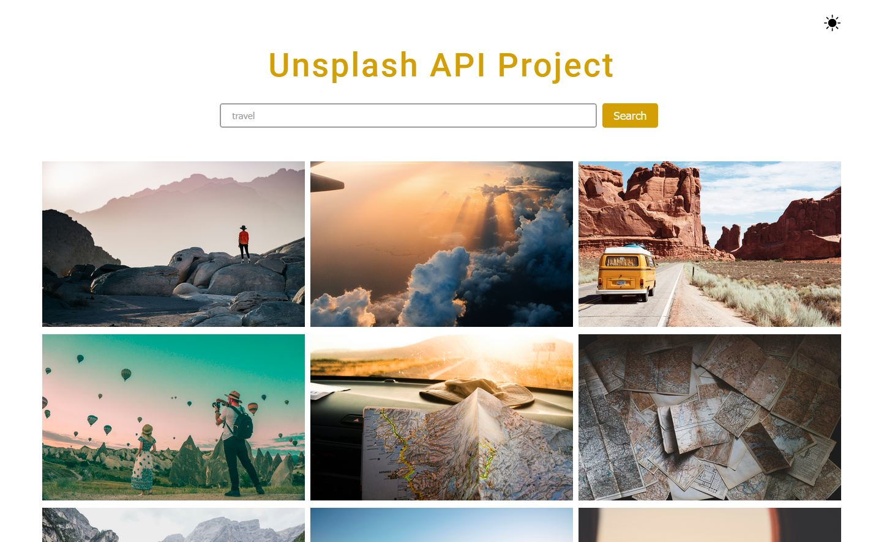

## Unsplash API Project

**Project URL:**
https://react-unsplash-api-project-1111.netlify.app/

**Key Features:**

- Fetching and displaying images from Unsplash API using React Query and Axios.
- Toggle between dark and light mode.
- Hiding secret API key while fetching data.

